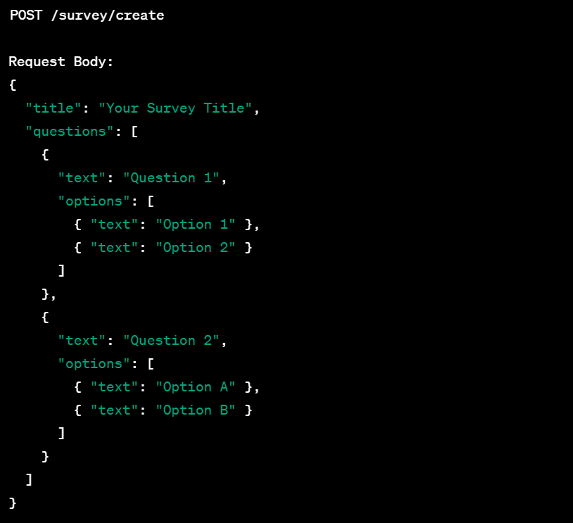

# Survey Poll App

Create a basic Survey/Poll application built with Node.js and Prisma.

## Overview

The application allows users to create and participate in surveys. Each survey consists of one or more questions, and each question can have multiple options. Users can select an option to vote in a survey.

## Features

- Create a new survey
- Get a list of all surveys
- Get details of a specific survey
- Vote in a survey
- Get the results of a survey

## Prerequisites

Before you begin, ensure you have met the following requirements:

- You have installed Node.js and npm.
- You have installed Prisma CLI.
- You have a PostgreSQL database setup.

## API Endpoints

The application provides the following endpoints:

- `GET /surveys`: Fetch all surveys.
- `POST /surveys`: Create a new survey.
- `GET /surveys/:id`: Fetch a specific survey.
- `PUT /surveys/:id`: Update a specific survey.
- `DELETE /surveys/:id`: Delete a specific survey.

## Tech Stack

- Node.js: JavaScript runtime
- Express.js: Web application framework
- Prisma: Next-generation Node.js and TypeScript ORM
- Jest: JavaScript testing framework

## Getting Started

Please follow the standard instructions to initiate a node app

- Clone the repo
  
1.Change your directory

```bash
cd survey-poll-app
```

2.Initiate a node app

```bash
npm init -y
```

3.Install dependencies

```bash
npm install express prisma 
```

4. Create Prisma schema file(you can directly paste the provided schema into it.make sure to provide db url)

```bash
npx prisma init
```

5. Configure Database Connection
In the schema.prisma file, update env("DATABASE_URL") with your actual PostgreSQL database connection URL.

6. Generate Prisma Client  

```bash
npx prisma generate
```

Now you can use prisma client in your code

7. Apply migrations

```bash
npx prisma migrate dev --name  <name for you migration>
```

8. Create an Express App

9. Implement CRUD Operations

Start Coding!!!

<br />

## Directory Structure

**NOTE:Please try to adhere to the below directory structure, follow the same naming convention for files and directories in your app, this is a good practice to create applications(Again that's optional)**

- Clone the repo and write your code inside `survey-poll-app`

```
survey-poll-app/
|-- node_modules/
|-- prisma/
|   |-- schema.prisma
|-- src/
|   |-- controllers/
|   |   |-- surveyController.js
|   |
|   |-- models/
|   |   |-- surveyModel.js
|   |
|   |-- routes/
|   |   |-- surveyRoutes.js
|   |
|   |-- config.js
|   |-- server.js
|-- package.json
|-- .env
```

<br><br>

## Prisma Schema for your Reference

**Note : Not mandatory to follow this. this is just for your reference**

Just try to follow this basic structure for creating a survey



<br>

<b>Click here to view schema<b>

<details>

<summary><b>Please try to make your own schema. Use this only if you are unable to make your own one<b></summary>

```
datasource db {
  provider = "postgresql"
  url      = env("DATABASE_URL")
}

generator client {
  provider = "prisma-client-js"
}

model Survey {
  id        Int      @id @default(autoincrement())
  title     String
  questions Question[]
}

model Question {
  id       Int      @id @default(autoincrement())
  text     String
  options  Option[]
  surveyId Int
  Survey   Survey   @relation(fields: [surveyId], references: [id])
}

model Option {
  id          Int      @id @default(autoincrement())
  text        String
  votes       Int      @default(0)
  questionId  Int
  Question    Question @relation(fields: [questionId], references: [id])
}

```

</details>
